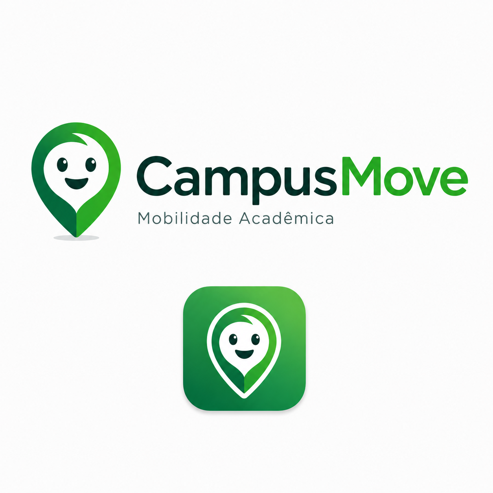
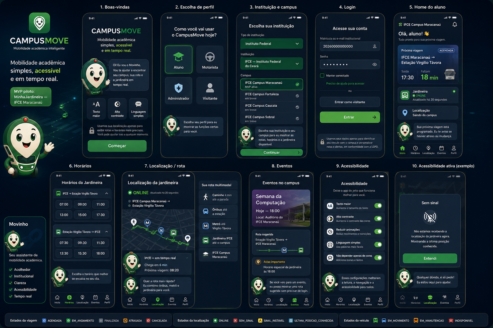
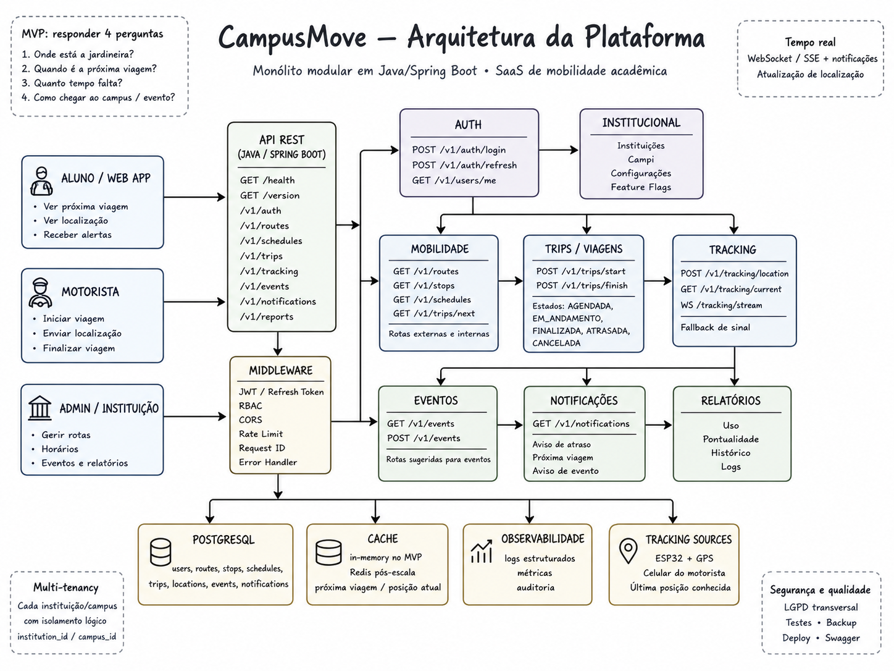

<p align="center">
  
</p>

<h1 align="center">CampusMove</h1>

<p align="center">
  Protótipo de web app SaaS para mobilidade acadêmica, transporte institucional, rotas e eventos.
</p>

<p align="center">
  <strong>CampusMove começa no campus. Escala para qualquer instituição.</strong>
</p>

---

## Sobre o projeto

**CampusMove** é um protótipo de plataforma SaaS voltada para **mobilidade acadêmica em instituições de ensino**.

A proposta do projeto é reunir, em um único ambiente digital, informações sobre:

- transporte institucional;
- horários de deslocamento;
- rotas até o campus;
- integração com transporte público;
- eventos acadêmicos;
- análise de chegada;
- planos alternativos de deslocamento.

Neste MVP, o CampusMove utiliza como caso principal o serviço **MinhaJardineira**, vinculado ao contexto do **IFCE Campus Maracanaú**.

O projeto foi desenvolvido como um **protótipo funcional front-end**, com foco em demonstração de produto, experiência do usuário, organização das regras de mobilidade e validação da ideia.

---

## Mascote do projeto

<p align="center">
  
</p>

O **Movinho** representa o assistente visual do CampusMove, reforçando a identidade do projeto como uma solução acessível, jovem e conectada ao ambiente acadêmico.

---

## Visão geral do protótipo

<p align="center">
  
</p>

O protótipo atual apresenta uma experiência de web app com navegação mobile-first, simulando o uso do CampusMove por diferentes perfis dentro de uma instituição.

Principais fluxos demonstrados:

- seleção de instituição, campus e perfil;
- tela inicial com informações de mobilidade;
- horários da MinhaJardineira;
- janela operacional do transporte institucional;
- cálculo local da próxima passagem;
- rotas demonstrativas;
- eventos acadêmicos;
- análise “Chego a tempo?”;
- Plano B demonstrativo.

---

## MVP: MinhaJardineira — IFCE Maracanaú

No MVP atual, o CampusMove simula o serviço **MinhaJardineira**, transporte institucional utilizado no contexto do IFCE Campus Maracanaú.

A lógica implementada considera:

- janelas operacionais informadas pela rotina do campus;
- passagens calculadas a cada 15 minutos dentro dessas janelas;
- duração estimada de deslocamento entre estação e campus;
- apoio com horários estáticos da Linha Sul;
- cálculo local baseado no horário do navegador;
- ausência de GPS, API ou rastreamento real.

Exemplo de funcionamento:

```txt
Janela operacional:
07:00–08:15

Sentido:
Metrô → Campus

Frequência:
A cada 15 minutos

Passagens calculadas:
07:00, 07:15, 07:30, 07:45, 08:00, 08:15
```

O sistema diferencia claramente:

```txt
Janela operacional ≠ duração da viagem
```

A janela indica quando o serviço está operando.  
A duração indica o tempo estimado de deslocamento entre os pontos.

---

## Funcionalidades implementadas

### Seleção SaaS

O protótipo possui um seletor demonstrativo de ambiente SaaS, permitindo escolher:

- tipo de instituição;
- instituição;
- campus;
- perfil de acesso.

A ideia é mostrar que o CampusMove pode ser adaptado para diferentes instituições e campi.

---

### Home

A tela inicial apresenta:

- saudação personalizada;
- data e horário do navegador;
- próxima janela ou próxima passagem da MinhaJardineira;
- cards de mobilidade;
- acesso rápido às principais áreas do app.

---

### Horários

A tela de horários apresenta a MinhaJardineira como **janelas operacionais**, não apenas como horários isolados.

Ao selecionar uma janela, o usuário vê:

- intervalo da janela;
- sentido do deslocamento;
- frequência;
- passagens calculadas;
- chegada estimada;
- observação sobre a origem dos dados.

---

### Ao vivo institucional

A seção “Ao vivo” não utiliza GPS nem rastreamento real.

Ela calcula localmente, com base nas janelas da MinhaJardineira, qual é a próxima passagem prevista.

Exemplo:

```txt
Jardineira 1
Metrô → Campus

Em janela de operação
Próxima passagem: 07:30
Sai em 8 min
A cada 15 min

Sem rastreamento real
```

---

### Localização

A área de localização apresenta rotas demonstrativas para chegar ou sair do campus, considerando o uso do transporte institucional e conexões com transporte público.

---

### Eventos

A tela de eventos permite simular deslocamentos para atividades acadêmicas.

O sistema analisa se o usuário consegue chegar a tempo, apresentando:

- horário de início;
- próxima passagem;
- chegada estimada;
- margem;
- status;
- recomendação;
- Plano B, quando necessário.

---

### Chego a tempo?

O recurso “Chego a tempo?” calcula localmente se o usuário consegue chegar antes do horário alvo.

Estados possíveis:

```txt
Chega a tempo
Chega com pouca margem
Risco de atraso
Não chega a tempo
Operação encerrada hoje
Análise indisponível
```

Margens negativas não são exibidas como números crus.  
Em vez disso, o protótipo mostra mensagens humanas, como:

```txt
Evento já começou há 4h12
```

ou:

```txt
Atraso estimado: 18 min
```

---

### Plano B demonstrativo

Quando há risco de atraso, ausência de operação ou evento já iniciado, o protótipo mostra um Plano B demonstrativo.

Exemplos:

- transporte público + caminhada;
- saída antecipada;
- consultar transporte institucional;
- rota alternativa demonstrativa.

O Plano B não representa uma rota oficial. É uma simulação de apoio à decisão.

---

## Arquitetura planejada

<p align="center">
  
</p>

A versão atual é um protótipo front-end estático.  
A arquitetura acima representa uma visão futura de evolução do CampusMove para uma solução completa.

A evolução planejada pode incluir:

- backend com Java Spring Boot;
- API REST;
- banco de dados relacional;
- autenticação;
- painel administrativo;
- cadastro de instituições;
- integração com dados oficiais;
- serviços de mobilidade em tempo real;
- versão PWA/mobile aprimorada.

---

## Tecnologias utilizadas

Protótipo atual:

- HTML5;
- CSS3;
- JavaScript modular;
- estrutura front-end estática;
- Git e GitHub.

Possível evolução futura:

- Java;
- Spring Boot;
- PostgreSQL;
- APIs REST;
- autenticação;
- serviços de integração;
- arquitetura SaaS multi-instituição.

---

## Estrutura do repositório

```txt
CampusMove/
├── apps/
│   └── prototype-html/
│       ├── assets/
│       ├── css/
│       ├── docs/
│       ├── js/
│       ├── index.html
│       └── README.md
│
├── backend/
│   └── README.md
│
├── data/
│   ├── campus.json
│   ├── horarios.json
│   └── rotas.json
│
├── docs/
│   ├── images/
│   │   ├── architecture-java-spring.png
│   │   ├── campusmove-logo.png
│   │   ├── movinho.png
│   │   └── prototype-overview.png
│   ├── acessibilidade-lgpd.md
│   ├── arquitetura.md
│   ├── decisoes-tecnicas.md
│   ├── pitch.md
│   ├── regras-de-negocio.md
│   └── visao-geral.md
│
├── frontend/
│   └── README.md
│
├── AGENTS.md
├── CONTRIBUTING.md
├── LICENSE
└── README.md
```

---

## Como executar o protótipo localmente

Acesse a pasta do protótipo:

```bash
cd apps/prototype-html
```

Inicie um servidor local:

```bash
python3 -m http.server 5505
```

Abra no navegador:

```txt
http://127.0.0.1:5505/index.html
```

---

## Status do projeto

O CampusMove está atualmente como:

```txt
Protótipo funcional front-end
```

O projeto ainda não possui:

- backend funcional;
- banco de dados;
- autenticação real;
- GPS;
- API externa;
- integração oficial em tempo real;
- painel administrativo;
- aplicativo nativo.

---

## Honestidade sobre os dados

Este projeto é um protótipo acadêmico demonstrativo.

Os dados utilizados são classificados em três níveis:

### 1. Janela operacional da MinhaJardineira

Horários informados pela rotina do campus, tratados como janelas aproximadas de operação.

```txt
Pode variar conforme operação do dia.
Sem rastreamento em tempo real.
```

### 2. Grade pública estática

Horários extraídos de grade pública, utilizados de forma estática no protótipo.

```txt
Não é integração em tempo real.
```

### 3. Estimativa demonstrativa

Valores usados apenas quando não há dado real cadastrado para determinado horário, estação ou cenário.

```txt
Sem dado real cadastrado.
```

O CampusMove não garante chegada em tempo real e não representa sistema oficial de transporte.

---

## Diferenciais da proposta

O CampusMove se diferencia por focar especificamente no contexto acadêmico.

Enquanto aplicativos comuns de mobilidade são genéricos, o CampusMove considera:

- transporte institucional;
- múltiplos campi;
- eventos acadêmicos;
- perfil do usuário;
- rotas internas;
- integração entre transporte institucional e transporte público;
- necessidades específicas de estudantes, servidores e visitantes.

---

## Possíveis usuários

- estudantes;
- servidores;
- visitantes;
- participantes de eventos;
- gestores de transporte institucional;
- instituições de ensino públicas e privadas.

---

## Possíveis instituições atendidas

O modelo SaaS permite adaptação para diferentes instituições, como:

- institutos federais;
- universidades públicas;
- universidades privadas;
- centros universitários;
- escolas técnicas;
- instituições multicampi.

---

## Próximos passos

Possíveis evoluções do projeto:

- transformar o protótipo em PWA;
- criar backend com Spring Boot;
- modelar banco de dados;
- criar autenticação;
- adicionar painel administrativo;
- cadastrar instituições e campi;
- integrar dados oficiais;
- criar módulo de motorista;
- melhorar acessibilidade;
- validar com usuários reais;
- evoluir para produto SaaS completo.

---

## Documentação complementar

A documentação do projeto está na pasta `docs/`.

Arquivos principais:

- [`docs/visao-geral.md`](docs/visao-geral.md)
- [`docs/arquitetura.md`](docs/arquitetura.md)
- [`docs/regras-de-negocio.md`](docs/regras-de-negocio.md)
- [`docs/decisoes-tecnicas.md`](docs/decisoes-tecnicas.md)
- [`docs/acessibilidade-lgpd.md`](docs/acessibilidade-lgpd.md)
- [`docs/pitch.md`](docs/pitch.md)

---

## Licença

Este projeto está sob a licença MIT.

Consulte o arquivo [`LICENSE`](LICENSE) para mais detalhes.

---

## Autor

Desenvolvido por **Cauê Pereira**.

Projeto criado como proposta de solução tecnológica para mobilidade acadêmica, com foco inicial no contexto do IFCE Campus Maracanaú.